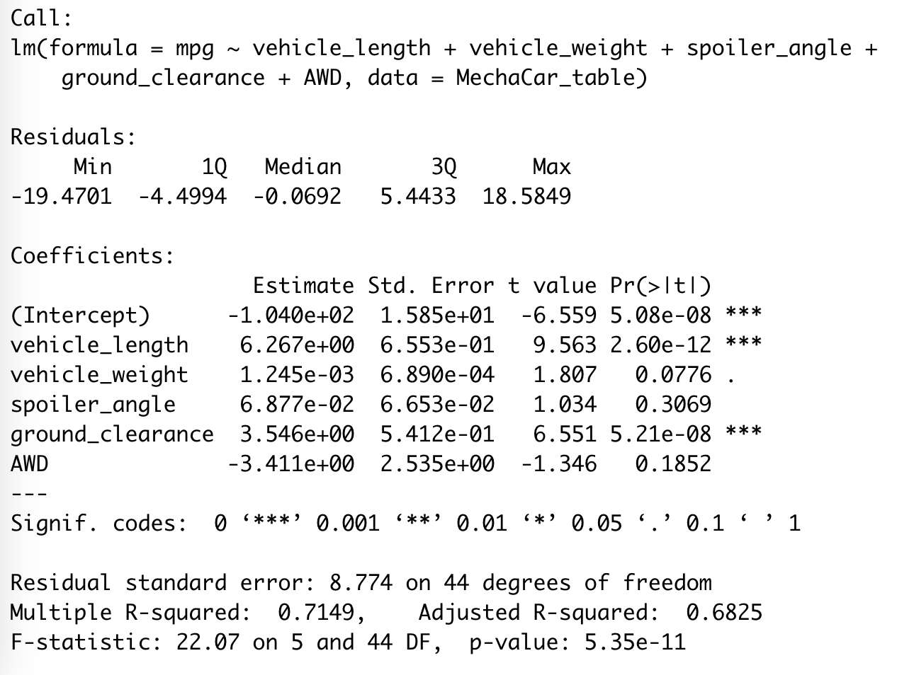
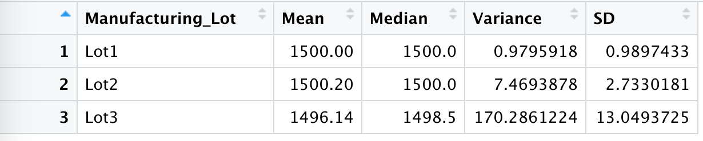

# MechaCar_Statistical_Analysis
Statistics and R 

## Linear Regression to Predict MPG 
From the original dataset's variables (vehicle length, weight, spoiler angle, drivetrain and ground clearance) , we first read our original csv into a table and performed Linear Regression using the lm() function in R. To find our p-value and r-squared value for the linear regression model, we had to use the summary function as well. 
```
# Library 
library(dplyr)

# Import and read csv
MechaCar_table <- read.csv(file='MechaCar_mpg.csv',check.names=F, stringsAsFactors = F)

# Perform Linear Regression using the lm() function 
lm(mpg ~ vehicle_length + vehicle_weight + spoiler_angle + ground_clearance + AWD, data=MechaCar_table)

# Summary for p-value and r-squared value for the linear regression model
summary(lm(mpg ~ vehicle_length + vehicle_weight + spoiler_angle + ground_clearance + AWD, data=MechaCar_table))
```
***Statistical Summary:*** 




From the statistical summary output, we can assume the following: 

1. With the p value of 0.05 as a standard of having a significance to the dataset, we see that the ***vehicle length*** (p value = 5.08e-08) and ***vehicle ground clearance*** (p value = 5.21e-08) most likely provided a non-random amount of variance to the mpg values in the dataset. Variables such as vehicle weight, spoiler angle, and AWD are not statistically significant and are most likely due to a random amount of variance since their p-value is > .05. 

2. The slopes of the variables are considered to be non-zero since the p-value for this model is ***p-value: 5.35e-11*** - which is much smaller than our assumed significance level of 0.05%. Therefore, we can state that there is sufficient evidence to reject our null hypothesis - meaning the slope of our linear model is not zero. 

From our analysis, the resulting model's linear regression formula 
```
mpg = 6.267(vehicle_length) + 1.245(vehicle_weight) + 6.877(spoiler_angle) + 3.546(ground_clearance) + -3.411(AWD) + -1.04 
```

3. The R-squared value of this model is 0.7149, which means that approximately 71.5% of this models predictions will fall on the linear regression model equation's line. This means that this linear model predicts mpg of MechaCar prototypes effectively. 


## Summary Statistics on Suspension Coils 
The MechaCar Suspension_Coil.csv dataset demonstrates the weight capacities of suspension coils. We are testing to see if the manufacturing process of suspension coils are consistent across production lots. To do so, we are using R to create summary statistics to show: 

-The suspension coil’s PSI continuous variable across all manufacturing lots.
-The following PSI metrics for each lot: mean, median, variance, and standard deviation.

After loading the dataset, we found the total_summary of the entire population. To find the mean, variance, and standard deviation of the suspension coil's PSI column, we used the summarize() function in R: 
```
total_summary <- SuspensionCoil_table %>% summarize(Mean=mean(PSI), Median=median(PSI), Variance=var(PSI), SD=sd(PSI))
```
The total_summary dataframe result is below. The mean is 1498.78, the median is 1500, the variance is 62.29, and the standard deviation is 7.89. 


To find the PSI metrics for each lot, we had to first use the group_by() function in order to summarize our data by lots. The following PSI metrics for each lot (the sample populations) are as follows: 



When comparing the sample population to the population summary statistics, the mean and the median PSI statistics are generally the same. However, when looking at the Variance, the sample lots variance differs to the population's variance. The design specifications for MechaCar suspension coils dictate that the variance of the suspension coils must not exceed 100 pounds per square inch (PSI). We can conclude that: 
- The manufacturing data meets the design specifications for all manufacturing lots (total_summary's variance = 62.29356) since the variance is less than 100 PSI. 
- When looking at each Lot individually, Lot 1 (variance = 0.9795918) and Lot 2 (7.4693878) are way below the 100 PSI standard. 
- However, Lot 3 does not meet the design specifications. Lot 3 shows a much larger variance with 170.2861224 PSI. 


## T-Tests on Suspension Coils
